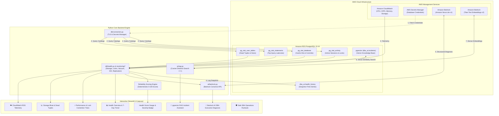

# 🛡️ AI PostgreSQL DBA Health Assistant for AWS RDS PostgreSQL 15.16

[](https://www.postgresql.org/)
[](https://aws.amazon.com/rds/)
[](https://aws.amazon.com/bedrock/)
[](https://github.com/pgvector/pgvector)
[](https://streamlit.io/)
[](https://www.python.org/)

An enterprise-grade, AI-powered Database Reliability Engineering platform combining **AWS RDS PostgreSQL 15.16** system telemetry, **Amazon Bedrock (Amazon Nova Lite)** generative reasoning, and **pgvector Retrieval-Augmented Generation (RAG)** to provide real-time database health diagnostics, lock contention trees, storage bloat analysis, and historical incident post-mortem matching.

---

## 📑 Table of Contents
1. [Project Overview & Problem Statement](#1-project-overview--problem-statement)
2. [End-to-End System Architecture](#2-end-to-end-system-architecture)
3. [Key Features & Capabilities](#3-key-features--capabilities)
4. [Tech Stack & AWS Services](#4-tech-stack--aws-services)
5. [Database Architecture & pgvector Schema](#5-database-architecture--pgvector-schema)
6. [AI & RAG Pipeline Breakdown](#6-ai--rag-pipeline-breakdown)
7. [Security & Credential Management](#7-security--credential-management)
8. [Repository Structure](#8-repository-structure)
9. [Step-by-Step Installation & Setup](#9-step-by-step-installation--setup)
10. [Streamlit Dashboard Walkthrough](#10-streamlit-dashboard-walkthrough)
11. [DBA Safety Guardrails & Operational Runbook](#11-dba-safety-guardrails--operational-runbook)
12. [Troubleshooting Common Issues](#12-troubleshooting-common-issues)
13. [Key Learnings & Skills Demonstrated](#13-key-learnings--skills-demonstrated)

---

## 1. Project Overview & Problem Statement

### The Problem
Traditional database monitoring tools (metrics graphs, static threshold alerts) alert DBAs *that* something is wrong (e.g., "CPU at 95%" or "Storage decreasing"), but they do not answer:
- *Why* is the database behaving this way?
- *Which* uncommitted transaction or query is holding locks?
- *How* did the team resolve this exact failure scenario six months ago?
- *What* exact, non-destructive SQL commands should the on-call engineer execute right now?

### The Solution
The **AI PostgreSQL DBA Health Assistant** transforms standard PostgreSQL system catalogs (`pg_stat_activity`, `pg_stat_database`, `pg_stat_statements`, `pg_statio_user_tables`) into structured semantic payloads. It sends these metrics to **Amazon Bedrock (Amazon Nova Lite)** for instant root-cause analysis and matches current symptoms against historical incident post-mortems stored in **pgvector** using cosine similarity (`<=>`).

---

## 2. End-to-End System Architecture



---

## 3. Key Features & Capabilities

- **⚡ Real-Time Health & Performance Monitoring**: Queries active backends, connection pool saturation, long-running queries (>10s / >5m), buffer cache hit ratio, and autovacuum metrics.
- **🔒 Active Lock Contention Tree**: Traces blocked queries back to root blocking PIDs and detects uncommitted transactions (`idle in transaction`).
- **📦 Storage Bloat & Growth Analytics**: Analyzes top tables by total disk space, index overhead, TOAST tables, dead tuple accumulation, and 7-day growth trends.
- **🕒 Transaction ID (XID) Wraparound Monitor**: Continuous calculation of distance to the 2.14B transaction freeze limit to prevent emergency database shutdowns.
- **☁️ AWS RDS CloudWatch Telemetry**: Integration with CloudWatch metrics (`CPUUtilization`, `DatabaseConnections`, `FreeStorageSpace`, `ReadIOPS`, `WriteIOPS`, `FreeableMemory`).
- **🤖 Amazon Bedrock Senior DBA Reasoning**: Uses the Bedrock `Converse` API (with Amazon Nova Lite / Claude 3) to generate non-destructive, safe diagnostic reports with copy-pasteable SQL commands.
- **🧠 pgvector Incident RAG Assistant**: Semantic search on historical DBA post-mortems using cosine similarity (`<=>`) and Amazon Titan Text Embeddings V2 to propose tested solutions.
- **🛡️ Strict DBA Safety Guardrails**: Designed with read-only analysis first—never executes destructive commands (DROP, TRUNCATE, TERMINATE) automatically.
- **🔄 Built-in Demo / Offline Simulation Mode**: Toggle simulation mode to test the UI and features without active AWS connections.

---

## 4. Tech Stack & AWS Services

| Layer | Technology | Purpose |
| :--- | :--- | :--- |
| **Database** | AWS RDS PostgreSQL 15.16 | Managed database engine with `pg_stat_statements` |
| **Vector Search** | `pgvector` extension | Native vector embedding storage & HNSW similarity search |
| **Generative AI** | Amazon Bedrock (`amazon.nova-lite-v1:0`) | Senior DBA reasoning via Bedrock `Converse` API |
| **Embeddings** | Amazon Titan Embeddings V2 (`amazon.titan-embed-text-v2:0`) | Generates 1024-dimensional normalized dense vectors |
| **Infrastructure** | Amazon CloudWatch | Pulls RDS CPU, IOPS, and memory metrics via `boto3` |
| **Security** | AWS Secrets Manager & IAM | Secure credential rotation and least-privilege access |
| **Backend** | Python 3.11 / 3.12, `psycopg` (v3), `boto3` | Database querying, mathematical scoring, and orchestration |
| **Frontend** | Streamlit, Plotly, Pandas | Interactive diagnostic web dashboard |

---

## 5. Database Architecture & pgvector Schema

The project creates a dedicated schema `dba_ai` with two primary tables:

```sql
-- 1. Schema and Extensions
CREATE EXTENSION IF NOT EXISTS pg_stat_statements;
CREATE EXTENSION IF NOT EXISTS vector;
CREATE SCHEMA IF NOT EXISTS dba_ai;

-- 2. Health Snapshot History Table
CREATE TABLE IF NOT EXISTS dba_ai.health_history (
    id BIGSERIAL PRIMARY KEY,
    collected_at TIMESTAMPTZ NOT NULL DEFAULT now(),
    database_name TEXT NOT NULL,
    connections INTEGER NOT NULL DEFAULT 0,
    max_connections INTEGER NOT NULL DEFAULT 100,
    database_size_bytes BIGINT NOT NULL DEFAULT 0,
    long_running_queries INTEGER NOT NULL DEFAULT 0,
    blocking_sessions INTEGER NOT NULL DEFAULT 0,
    xid_age BIGINT NOT NULL DEFAULT 0,
    cache_hit_ratio NUMERIC(5, 2) DEFAULT 99.0,
    replication_lag_seconds DOUBLE PRECISION DEFAULT 0.0,
    status TEXT NOT NULL DEFAULT 'HEALTHY'
);

-- 3. Historical Incident Knowledge Base (pgvector)
CREATE TABLE IF NOT EXISTS dba_ai.incidents (
    id BIGSERIAL PRIMARY KEY,
    title TEXT NOT NULL,
    problem TEXT NOT NULL,
    root_cause TEXT NOT NULL,
    resolution TEXT NOT NULL,
    prevention TEXT NOT NULL,
    embedding VECTOR(1024), -- 1024-dim dense vectors from Titan V2
    created_at TIMESTAMPTZ DEFAULT now()
);

-- 4. HNSW Vector Cosine Distance Index
CREATE INDEX IF NOT EXISTS idx_incidents_embedding_hnsw
ON dba_ai.incidents
USING hnsw (embedding vector_cosine_ops);
```

---

## 6. AI & RAG Pipeline Breakdown

```
[User Problem / Query]
       │
       ▼
[Amazon Titan Embeddings V2] ──► 1024-Dimensional Dense Vector
       │
       ▼
[pgvector Cosine Search (<=>)] ──► Retrieves Top-3 Matched Incidents
       │
       ▼
[Prompt Augmentation Engine] ──► Combines:
                                  1. Live PostgreSQL Metrics
                                  2. Matched Historical Root Causes
                                  3. User Inquiry
       │
       ▼
[Amazon Bedrock (Nova Lite)] ──► Executive DBA Action Plan + Safe Investigation SQL
```

### Deterministic Health Scoring Algorithm
Before asking the LLM, the backend runs a mathematical scoring algorithm:
- **Base Score:** 100
- **Blocking Sessions Penalty:** -20 per blocking lock (max -40)
- **Long-Running Queries (>5m):** -10 for first query, -3 per additional (max -25)
- **Buffer Cache Hit Ratio:** -15 if <95%, -30 if <85%
- **Connection Saturation:** -10 if >70% capacity, -20 if >85%
- **XID Wraparound Risk:** -10 if >500M, -25 if >1B, -40 if >1.5B
- **Severity Mapping:** `90–100: 🟢 HEALTHY` | `70–89: 🟠 WARNING` | `<70: 🔴 CRITICAL`

---

## 7. Security & Credential Management

All secrets and credentials are kept strictly in environment variables and are **never hardcoded or committed to GitHub**:

1. [`.gitignore`](.gitignore) is pre-configured to exclude `.env`, `.venv`, credentials, and caches.
2. [`.env.example`](.env.example) serves as the clean configuration template.
3. Supports **AWS Secrets Manager** for dynamic password retrieval in production:
   ```ini
   USE_SECRETS_MANAGER=true
   RDS_SECRET_NAME=postgres-dba-ai-secret
   ```
4. All database connections enforce TLS encryption (`sslmode=require`).

---

## 8. Repository Structure

```
ai-postgres-dba/
├── README.md                  # Comprehensive GitHub Documentation (You are here)
├── requirements.txt          # Python dependencies (psycopg, boto3, pgvector, streamlit)
├── .env.example              # Configuration template for credentials & models
├── .gitignore                # Protects secrets, credentials, and virtualenvs
├── app.py                    # Streamlit web dashboard with 7 diagnostic tabs
├── config.py                 # Configuration loader & Secrets Manager handler
├── init_db.py                # Database setup runner via Python (no psql required)
├── test_connection.py        # RDS & extension connectivity diagnostic tool
├── test_bedrock.py           # Bedrock Nova & Titan Embedding test script
│
├── db/                       # Database Access & Telemetry Layer
│   ├── __init__.py
│   ├── connection.py         # TLS connection factory with Secrets Manager
│   ├── queries.py            # Diagnostic SQL queries catalog
│   ├── health.py             # Telemetry collector & reliability scoring engine
│   └── history.py            # Snapshot persistence & 7-day trend logger
│
├── monitoring/               # Specialized DBA Diagnostic Modules
│   ├── __init__.py
│   ├── storage.py            # Table/Index bloat & TOAST inspection
│   ├── locks.py              # Recursive lock contention tree analyzer
│   ├── vacuum.py             # Dead tuples & autovacuum tracker
│   ├── xid.py                # Transaction ID wraparound risk calculator
│   ├── replication.py        # Standby replica replay lag & WAL backlog
│   └── cloudwatch.py         # RDS CloudWatch CPU/IOPS/Storage telemetry
│
├── ai/                       # Generative AI & Vector Search Engine
│   ├── __init__.py
│   ├── bedrock.py            # Bedrock Converse API client (Nova Lite / Claude)
│   ├── embeddings.py         # Amazon Titan Text Embeddings V2 client
│   ├── prompts.py            # Senior DBA system prompts & safety guardrails
│   └── rag.py                # pgvector cosine similarity search (<=>) & RAG pipeline
│
├── sql/                      # SQL Schema & Reference Books
│   ├── setup.sql             # Extensions, schema, tables, seed incidents, HNSW index
│   ├── health_queries.sql    # Manual query reference guide for DBAs
│   └── rag.sql               # pgvector similarity queries and testing scripts
│
└── docs/                     # Technical Guides
    ├── architecture.md       # Architecture diagrams & component breakdown
    ├── setup.md              # Detailed AWS RDS & Bedrock provisioning guide
    └── troubleshooting.md    # Troubleshooting manual for connection/IAM issues
```

---

## 9. Step-by-Step Installation & Setup

### Prerequisites
- Python 3.11 or 3.12 installed
- AWS Account with RDS PostgreSQL 15.16 and Amazon Bedrock access
- AWS CLI configured (`aws configure`)

### Step 1: Clone Repository & Create Virtual Environment
```powershell
# Clone the repository
git clone https://github.com/your-username/ai-postgres-dba.git
cd ai-postgres-dba

# Create virtual environment
py -3.12 -m venv .venv

# Activate on Windows PowerShell:
.\.venv\Scripts\Activate.ps1

# Activate on Linux / macOS:
# source .venv/bin/activate

# Install dependencies
pip install -r requirements.txt
```

### Step 2: Configure Environment Variables
Copy the template to create your `.env` file:
```powershell
copy .env.example .env
```
Edit `.env` with your actual AWS RDS credentials and Bedrock configuration:
```ini
AWS_REGION=us-east-1

# PostgreSQL RDS Connection Settings
RDS_HOST=ai-postgres-dba.xxxxxxxxx.us-east-1.rds.amazonaws.com
RDS_PORT=5432
RDS_DATABASE=dba_ai
RDS_USER=postgres
RDS_PASSWORD=YourSecurePasswordHere
RDS_SSLMODE=require

# Bedrock Foundation Models
BEDROCK_MODEL_ID=amazon.nova-lite-v1:0
BEDROCK_EMBEDDING_MODEL_ID=amazon.titan-embed-text-v2:0
EMBEDDING_DIMENSION=1024

# CloudWatch & Simulation
ENABLE_CLOUDWATCH=true
RDS_INSTANCE_IDENTIFIER=ai-postgres-dba
DEMO_MODE=false
```

### Step 3: Initialize Database Schema & pgvector Tables
Run the initialization script using Python (no `psql` required):
```powershell
python init_db.py
```
*(Or via `psql`: `psql -h YOUR_RDS_ENDPOINT -U postgres -d dba_ai -f sql/setup.sql`)*

### Step 4: Run Diagnostic Verification
```powershell
# Verify RDS connection, extensions, and catalog collectors
python test_connection.py

# Verify Amazon Bedrock Nova Lite and Titan Embeddings
python test_bedrock.py
```

### Step 5: Launch the Streamlit Dashboard
```powershell
streamlit run app.py
```
Open your browser at **`http://localhost:8501`**.

---

## 10. Streamlit Dashboard Walkthrough

The web application provides a 7-tab interface:

| Tab | Name | Capabilities |
| :---: | :--- | :--- |
| **1** | **📊 Health Overview** | Real-time reliability gauge (0–100), severity badge, KPI cards, and 7-day database growth trend charts. |
| **2** | **⚡ Performance & Locks** | Live recursive blocking tree (shows root blocking PID and uncommitted queries), slow queries (>10s), and top SQL execution times (`pg_stat_statements`). |
| **3** | **📈 Storage & Bloat** | Top 10 largest tables, index overhead breakdown, dead tuple ratios, and autovacuum candidate identification. |
| **4** | **☁️ CloudWatch RDS** | AWS CloudWatch infrastructure telemetry (CPU Utilization %, Free Storage GB, IOPS, Memory) and alarm recommendations. |
| **5** | **🤖 Bedrock AI DBA** | One-click senior DBA analysis powered by Amazon Nova Lite: executive summaries, root-cause identification, and safe SQL investigation commands. |
| **6** | **🧠 pgvector RAG Assistant** | Natural language DBA question answering using vector similarity matching against historical incident post-mortems. |
| **7** | **🛡️ Safe DBA Runbook** | Copy-pasteable safe SQL commands for graceful backend cancellation, non-blocking re-indexing (`REINDEX CONCURRENTLY`), and timeout parameters. |

---

## 11. DBA Safety Guardrails & Operational Runbook

The application enforces **strict read-only safety rules** for AI recommendations:

```text
               AI Analysis Engine
                      │
                      ▼
         Safe Diagnostic Recommendation
                      │
                      ▼
             DBA Human Reviews
                      │
                      ▼
              DBA Executes SQL
```

### Safe SQL Cheat Sheet
```sql
-- 1. Gracefully cancel a query (allows clean rollback):
SELECT pg_cancel_backend(14205);

-- 2. Terminate connection if cancel does not respond after 30s:
SELECT pg_terminate_backend(14205);

-- 3. Reclaim index space without locking table:
REINDEX INDEX CONCURRENTLY idx_orders_customer_id;

-- 4. Prevent abandoned sessions in RDS Parameter Group:
ALTER ROLE app_user SET idle_in_transaction_session_timeout = '60s';
ALTER ROLE app_user SET statement_timeout = '30s';
```

---

## 12. Troubleshooting Common Issues

| Error | Root Cause | Solution |
| :--- | :--- | :--- |
| `[Errno 11001] getaddrinfo failed` | Using private internal hostname (`*.ec2.internal`) from outside AWS VPC. | Use the public RDS endpoint (`*.rds.amazonaws.com`) and ensure **Publicly Accessible = Yes** in RDS. |
| `Connection timed out` | Security Group blocking port 5432. | Edit RDS Security Group inbound rules and allow **Type: PostgreSQL (5432)** from **My IP**. |
| `extension "vector" is not available` | Unsupported minor version. | Ensure RDS engine is PostgreSQL 15.2 or later (such as 15.16). |
| `AccessDeniedException` on Bedrock | IAM role missing permissions or model access not granted. | Enable **Amazon Nova Lite** in Bedrock Model Access console and attach `bedrock:Converse` IAM permission. |
| `psql : The term is not recognized` | PostgreSQL client tools not in Windows PATH. | Run `python init_db.py` instead of `psql`. |

---

## 13. Key Learnings & Skills Demonstrated

- **PostgreSQL Internals**: Deep queries into system catalogs (`pg_stat_activity`, `pg_stat_database`, `pg_stat_statements`, `pg_statio_user_tables`).
- **AWS Cloud Architecture**: RDS PostgreSQL 15.16, CloudWatch telemetry, Secrets Manager, VPC security groups, and IAM least-privilege policies.
- **Generative AI & Prompt Engineering**: AWS Bedrock `Converse` API, senior DBA system instructions, safety guardrails, and structured output parsing.
- **Vector Search & RAG**: `pgvector` extension, HNSW cosine distance indexing (`<=>`), and Amazon Titan Text Embeddings V2 integration.
- **Production Python Development**: `psycopg` (v3) binary drivers, connection pooling, context managers, and Streamlit dashboard design.
- **Site Reliability Engineering (SRE)**: Lock tree resolution, transaction ID wraparound prevention, table bloat remediation, and replica lag mitigation.

---

## 📄 License
This project is licensed under the MIT License - see the [LICENSE](LICENSE) file for details.
# postgres-reliability-assistant

