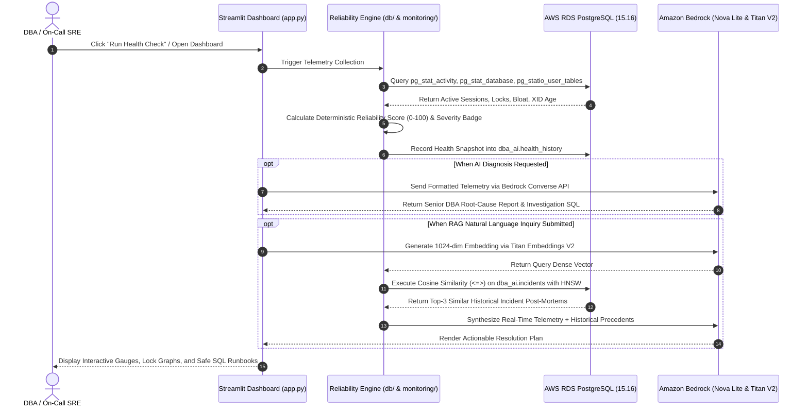

# 🛡️ PostgreSQL Reliability Assistant (AI-Powered DBA)

> **Enterprise-grade Database Reliability Engineering platform for AWS RDS PostgreSQL 15.16 powered by Amazon Bedrock (Nova Lite), pgvector RAG, and Streamlit.**

[](https://www.postgresql.org/)
[](https://aws.amazon.com/rds/)
[](https://aws.amazon.com/bedrock/)
[-0064a5?style=flat-square&logo=postgresql&logoColor=white)](https://github.com/pgvector/pgvector)
[](https://streamlit.io/)
[](https://www.python.org/)
[](LICENSE)

---

## 📌 Executive Summary

Traditional database monitoring alerts you *when* an issue happens, but leaves the DBA to manually reconstruct query trees, inspect lock graphs, and search past incident tickets. 

The **PostgreSQL Reliability Assistant** bridges low-level PostgreSQL system catalogs with **Amazon Bedrock generative reasoning** and **pgvector historical incident retrieval (RAG)** to provide:
1. **Instant Root-Cause Identification**: Traces lock contention to root blocking PIDs and uncommitted transactions (`idle in transaction`).
2. **Predictive Reliability Scoring**: Mathematical health score (0–100) assessing memory pressure, connection pool saturation, table bloat, and transaction ID (XID) wraparound risk.
3. **Retrieval-Augmented Guidance (RAG)**: Matches real-time symptoms against historical incident post-mortems using vector cosine similarity (`<=>`).
4. **Safe, Read-Only DBA Runbooks**: Automatically generates non-destructive diagnostic SQL queries for safe human verification.

---

## 🏗️ System Architecture

```
                                      AWS CLOUD
 ┌──────────────────────────────────────────────────────────────────────────────────┐
 │                                                                                  │
 │   ┌────────────────────────┐   ┌────────────────────────┐   ┌─────────────────┐  │
 │   │  AWS RDS PostgreSQL    │   │    Amazon Bedrock      │   │ AWS CloudWatch  │  │
 │   │        (15.16)         │   │                        │   │                 │  │
 │   │ ────────────────────── │   │ ────────────────────── │   │ ─────────────── │  │
 │   │ • pg_stat_activity     │   │ • Amazon Nova Lite     │   │ • CPU & IOPS    │  │
 │   │ • pg_stat_database     │   │ • Amazon Titan V2      │   │ • Free Storage  │  │
 │   │ • pg_stat_statements   │   │   (1024-dim Embeddings)│   │ • Free Memory   │  │
 │   │ • pg_stat_user_tables  │   └───────────▲────────────┘   └────────▲────────┘  │
 │   │ • pgvector (HNSW)      │               │                         │           │
 │   └───────────▲────────────┘               │                         │           │
 └───────────────┼────────────────────────────┼─────────────────────────┼───────────┘
                 │ (psycopg TLS / SSL)        │ (boto3 Converse API)    │ (boto3)
                 ▼                            ▼                         ▼
 ┌──────────────────────────────────────────────────────────────────────────────────┐
 │                          PYTHON RELIABILITY ENGINE                               │
 │                                                                                  │
 │   ┌───────────────────────┐   ┌───────────────────────┐   ┌──────────────────┐   │
 │   │  Telemetry Collector  │   │  Deterministic Scorer │   │   RAG Pipeline   │   │
 │   │   (Locks, XID, Bloat) │──►│   (0-100 Health Index)│──►│ (pgvector Search)│   │
 │   └───────────────────────┘   └───────────────────────┘   └──────────────────┘   │
 └────────────────────────────────────────┬─────────────────────────────────────────┘
                                          │
                                          ▼
 ┌──────────────────────────────────────────────────────────────────────────────────┐
 │                            STREAMLIT WEB DASHBOARD                               │
 │                                                                                  │
 │   📊 Health Matrix    ⚡ Lock Trees    📈 Storage Bloat    🤖 Bedrock AI Report │
 └──────────────────────────────────────────────────────────────────────────────────┘
```

---

## 🔄 Flow of Execution



---

## 📂 Project Structure

```text
postgres-reliability-assistant/
│
├── ⚙️ Configuration & Environment
│   ├── .env.example              # Environment template (safe for git)
│   ├── .env                      # Local credentials (EXCLUDED by .gitignore)
│   ├── .gitignore                # Enterprise exclusion rules (secrets, venv, caches)
│   ├── config.py                 # Central config loader & AWS Secrets Manager handler
│   └── requirements.txt          # Pinned production dependencies
│
├── 🖥️ Application & CLI Scripts
│   ├── app.py                    # Main Streamlit web dashboard (7 diagnostic tabs)
│   ├── init_db.py                # Database setup script via Python (no psql required)
│   ├── test_connection.py        # RDS connectivity & extension diagnostic tool
│   └── test_bedrock.py           # Amazon Bedrock & pgvector diagnostic tool
│
├── 🗄️ Database Layer (db/)
│   ├── __init__.py               # Layer exports
│   ├── connection.py             # TLS psycopg connection factory with Secrets Manager
│   ├── queries.py                # Centralized catalog SQL statements
│   ├── health.py                 # Telemetry collector & reliability scoring engine (0-100)
│   └── history.py                # Snapshot recorder & 7-day trend time-series generator
│
├── 🔍 Specialized Monitoring Modules (monitoring/)
│   ├── __init__.py               # Layer exports
│   ├── storage.py                # Table/Index bloat & TOAST inspection
│   ├── locks.py                  # Recursive lock contention tree analyzer
│   ├── vacuum.py                 # Autovacuum tracking & dead tuple ratio inspector
│   ├── xid.py                    # Transaction ID (XID) wraparound risk calculator
│   ├── replication.py            # Standby replica replay lag & WAL backlog monitor
│   └── cloudwatch.py             # AWS CloudWatch RDS infrastructure telemetry (CPU/IOPS)
│
├── 🤖 Generative AI & Vector Search Engine (ai/)
│   ├── __init__.py               # Layer exports
│   ├── bedrock.py                # Bedrock Converse API client (Nova Lite / Claude)
│   ├── embeddings.py             # Amazon Titan Text Embeddings V2 dense vector generator
│   ├── prompts.py                # Senior DBA system prompts & non-destructive safety guardrails
│   └── rag.py                    # pgvector cosine similarity search (<=>) & RAG pipeline
│
├── 📜 Database Schema & Catalogs (sql/)
│   ├── setup.sql                 # DDL for schema, extensions, tables, seed incidents, HNSW
│   ├── health_queries.sql        # Standalone manual diagnostic query catalog for DBAs
│   └── rag.sql                   # pgvector vector operations & similarity testing
│
└── 📚 Documentation & Legal
    ├── docs/
    │   ├── architecture.md       # Detailed architectural breakdown & diagrams
    │   ├── setup.md              # AWS RDS & Bedrock provisioning step-by-step
    │   └── troubleshooting.md    # Common errors (DNS, Security Groups, IAM)
    ├── README.md                 # Primary project documentation
    └── LICENSE                   # MIT Open Source License
```

---

## 🎛️ Dashboard Features (7 Diagnostic Tabs)

| Tab | Feature | Description |
| :---: | :--- | :--- |
| **1** | **📊 Health Overview** | Dynamic Reliability Gauge (0–100), severity badge (`HEALTHY`, `WARNING`, `CRITICAL`), KPI metrics, and a 7-day database growth trend chart. |
| **2** | **⚡ Performance & Locks** | Reconstructs recursive lock contention trees (showing root blocking PIDs and uncommitted queries), slow queries (>10s), and top SQL statements (`pg_stat_statements`). |
| **3** | **📈 Storage & Bloat** | Top 10 largest tables by disk footprint, index overhead breakdown, dead tuple ratios, and autovacuum candidate tables. |
| **4** | **☁️ CloudWatch RDS** | Real-time AWS CloudWatch telemetry (CPU %, Free Storage GB, IOPS, Memory) and production alarm recommendations. |
| **5** | **🤖 Bedrock AI DBA** | One-click senior DBA diagnosis powered by Amazon Nova Lite: executive health summary, root causes, and safe copy-pasteable SQL. |
| **6** | **🧠 pgvector RAG Assistant** | Natural language DBA question answering using vector similarity matching against historical incident post-mortems. |
| **7** | **🛡️ Safe DBA Runbook** | Ready-to-use safe commands for graceful session cancellation (`pg_cancel_backend`), non-blocking re-indexing (`CONCURRENTLY`), and timeout parameters. |

---

## 📊 Database Schema & pgvector Setup

The database schema is organized under the dedicated `dba_ai` namespace:

```sql
-- 1. Enable Required Extensions
CREATE EXTENSION IF NOT EXISTS pg_stat_statements;
CREATE EXTENSION IF NOT EXISTS vector;
CREATE SCHEMA IF NOT EXISTS dba_ai;

-- 2. Health Snapshot History Table
CREATE TABLE IF NOT EXISTS dba_ai.health_history (
    id BIGSERIAL PRIMARY KEY,
    collected_at TIMESTAMPTZ NOT NULL DEFAULT now(),
    database_name TEXT NOT NULL,
    connections INTEGER NOT NULL DEFAULT 0,
    max_connections INTEGER NOT NULL DEFAULT 100,
    database_size_bytes BIGINT NOT NULL DEFAULT 0,
    long_running_queries INTEGER NOT NULL DEFAULT 0,
    blocking_sessions INTEGER NOT NULL DEFAULT 0,
    xid_age BIGINT NOT NULL DEFAULT 0,
    cache_hit_ratio NUMERIC(5, 2) DEFAULT 99.0,
    status TEXT NOT NULL DEFAULT 'HEALTHY'
);

-- 3. Incident Knowledge Base for pgvector RAG
CREATE TABLE IF NOT EXISTS dba_ai.incidents (
    id BIGSERIAL PRIMARY KEY,
    title TEXT NOT NULL,
    problem TEXT NOT NULL,
    root_cause TEXT NOT NULL,
    resolution TEXT NOT NULL,
    prevention TEXT NOT NULL,
    embedding VECTOR(1024), -- 1024-dim dense vectors from Amazon Titan V2
    created_at TIMESTAMPTZ DEFAULT now()
);

-- 4. HNSW Vector Cosine Distance Index
CREATE INDEX IF NOT EXISTS idx_incidents_embedding_hnsw
ON dba_ai.incidents
USING hnsw (embedding vector_cosine_ops);
```

---

## 🚀 Quick Start (5-Minute Setup)

### 1. Prerequisites
- Python 3.11 or 3.12
- AWS RDS PostgreSQL 15.16 instance (or local PostgreSQL with `pgvector`)
- AWS credentials with Amazon Bedrock access

### 2. Installation
```powershell
# Clone repository
git clone https://github.com/Krishnaale-AI/postgres-reliability-assistant.git
cd postgres-reliability-assistant

# Create & activate virtual environment
py -3.12 -m venv .venv
.\.venv\Scripts\Activate.ps1   # On Windows
# source .venv/bin/activate    # On Linux/macOS

# Install dependencies
pip install -r requirements.txt
```

### 3. Configure Environment Variables
```powershell
copy .env.example .env
```
Edit [`.env`](.env) with your credentials:
```ini
AWS_REGION=us-east-1

# PostgreSQL RDS Connection Settings
RDS_HOST=ai-postgres-dba.xxxxxxxxx.us-east-1.rds.amazonaws.com
RDS_PORT=5432
RDS_DATABASE=dba_ai
RDS_USER=postgres
RDS_PASSWORD=YourSecurePasswordHere
RDS_SSLMODE=require

# Bedrock Foundation Models
BEDROCK_MODEL_ID=amazon.nova-lite-v1:0
BEDROCK_EMBEDDING_MODEL_ID=amazon.titan-embed-text-v2:0
EMBEDDING_DIMENSION=1024
```

### 4. Initialize Database Schema
Run the setup script using Python (no `psql` CLI required):
```powershell
python init_db.py
```

### 5. Run Diagnostics
```powershell
# Test RDS database connectivity and extensions
python test_connection.py

# Test Amazon Bedrock Nova Lite and Titan Embeddings
python test_bedrock.py
```

### 6. Launch the Dashboard
```powershell
streamlit run app.py
```
Open **`http://localhost:8501`** in your browser.

---

## 🛡️ DBA Safety Guardrails

The application is built with a **read-only safety philosophy**:

> [!IMPORTANT]
> The AI assistant **never executes mutating SQL automatically**. All remediation plans provide diagnostic commands for human review before execution.

```sql
-- Safe session cancellation (gives backend chance to roll back cleanly):
SELECT pg_cancel_backend(14205);

-- Terminate session only if unresponsive after 30s:
SELECT pg_terminate_backend(14205);

-- Non-blocking index rebuild:
REINDEX INDEX CONCURRENTLY idx_orders_customer_id;

-- Enforce session timeout limits in Parameter Group:
ALTER ROLE app_user SET idle_in_transaction_session_timeout = '60s';
ALTER ROLE app_user SET statement_timeout = '30s';
```

---

## 🔧 Troubleshooting Matrix

| Issue | Cause | Solution |
| :--- | :--- | :--- |
| `[Errno 11001] getaddrinfo failed` | Using private internal DNS (`*.ec2.internal`) from outside AWS VPC. | Use the public RDS endpoint (`*.rds.amazonaws.com`) and ensure **Publicly Accessible = Yes**. |
| `Connection timed out` | RDS Security Group blocking port 5432. | Add Inbound Rule for **Type: PostgreSQL (5432)** from **Source: My IP**. |
| `extension "vector" is not available` | Unsupported minor version. | Ensure PostgreSQL engine version is 15.2 or later (such as 15.16). |
| `AccessDeniedException` on Bedrock | IAM policy missing Bedrock permissions. | Enable **Amazon Nova Lite** in Bedrock Model Access and grant `bedrock:Converse`. |
| Offline / No AWS access | Developing locally without active AWS. | Set `DEMO_MODE=true` in `.env` to explore all dashboard features with simulated cluster telemetry. |

---

## 📄 License

This project is licensed under the MIT License - see the [LICENSE](LICENSE) file for details.