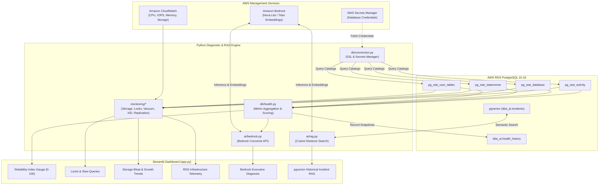

# AI PostgreSQL DBA Health Assistant - Architecture Guide

## 1. System Overview

The **AI PostgreSQL DBA Health Assistant** is an intelligent monitoring, diagnostic, and remediation assistant designed for **AWS RDS PostgreSQL 15.16**. It bridges deep database telemetry with generative AI reasoning using **Amazon Bedrock** and vector similarity retrieval via **pgvector**.

---

## 2. Key Subsystems

### A. Database Health Engine (`db/`)
- **Connection Factory (`connection.py`)**: Enforces TLS (`sslmode=require`) connections and supports dynamic credential resolution from AWS Secrets Manager.
- **Health Collector (`health.py`)**: Gathers metrics from PostgreSQL system catalogs (`pg_stat_activity`, `pg_stat_database`, `pg_statio_user_tables`, `pg_database`).
- **Deterministic Reliability Score (`calculate_health_score`)**: Computes a score (0–100) and severity rating (`HEALTHY`, `WARNING`, `CRITICAL`) using mathematical penalty weights for lock contention, long-running queries, buffer cache misses, and XID age.
- **Snapshot Persistence (`history.py`)**: Stores time-series health metrics in `dba_ai.health_history` for trend visualization.

### B. Specialized DBA Monitoring Modules (`monitoring/`)
- **Storage Bloat (`storage.py`)**: Analyzes table sizes, index overhead, and TOAST distribution.
- **Lock Contention (`locks.py`)**: Reconstructs recursive blocking trees to trace root blocking backends.
- **Autovacuum & Dead Tuples (`vacuum.py`)**: Tracks dead tuple ratios and autovacuum worker execution.
- **Transaction ID Wraparound (`xid.py`)**: Monitors `datfrozenxid` and `relfrozenxid` against PostgreSQL's 2.14B limit.
- **Replication Lag (`replication.py`)**: Tracks streaming replica replay delay and WAL backlog.
- **CloudWatch Telemetry (`cloudwatch.py`)**: Pulls CPU utilization, IOPS, and storage headroom from AWS CloudWatch.

### C. Generative AI & pgvector RAG (`ai/`)
- **Bedrock Converse API (`bedrock.py`)**: Generates structured, non-destructive DBA reports using foundation models like Amazon Nova Lite (`amazon.nova-lite-v1:0`).
- **Titan Embeddings (`embeddings.py`)**: Computes 1024-dimensional normalized dense vectors with Amazon Titan Text Embeddings V2.
- **RAG Engine (`rag.py`)**: Executes cosine similarity searches (`<=>`) on `dba_ai.incidents` using `pgvector` HNSW indexes and synthesizes augmented solutions.
- **Safety Guardrails (`prompts.py`)**: Strict system prompts enforcing read-only investigation first, with copy-pasteable SQL commands for safe DBA execution.
